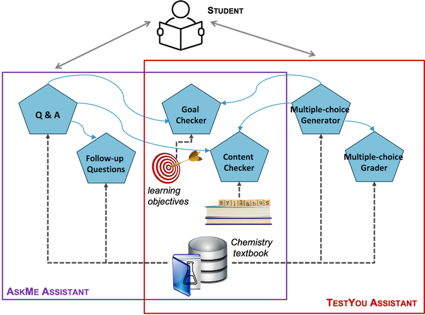

# chemistry-agents
A demo about an agentic workflow applied to a chemistry classroom.

This proof-of-concept implements 2 assistants:

* **AskMe**: It provides support for Q&A from students about chemistry topics. The questions are anwsered from a chemistry textbook.
* **TestYou**: It can generate multiple-choice questions for an input topic. Once the student answers the question, it is automatically graded.

In addition, the assistants can link the questions and answers to predefined learning goals and course contents.

Both assistants are internally designed as agentic workflows using the [Phidata](https://www.phidata.com/) framework.
